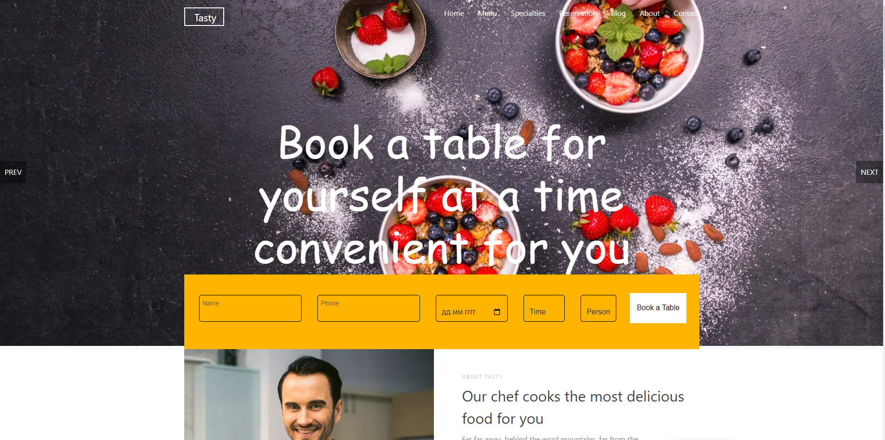

# My Web Site for Ordering Food

Welcome to my React.js project for ordering food! This project includes seven pages:

- **Home**: Landing page for the website.
- **Menu**: Display of the available menu items.
- **Specialties**: Special dishes offered by the restaurant.
- **Reservation**: Form for making reservations.
- **Blog**: Blog section for sharing news or articles.
- **About**: Information about the restaurant.
- **Contact**: Contact form for reaching out to the restaurant.

## Technologies Used

- React.js
- HTML
- CSS
- JavaScript
- Local Storage

## How to Run

1. Clone the repository.
2. Navigate to the project directory.
3. Install dependencies: `npm install`.
4. Start the development server: `npm start`.

## Contribution

Contributions are welcome! If you find any issues or have suggestions for improvement, feel free to submit a pull request.

